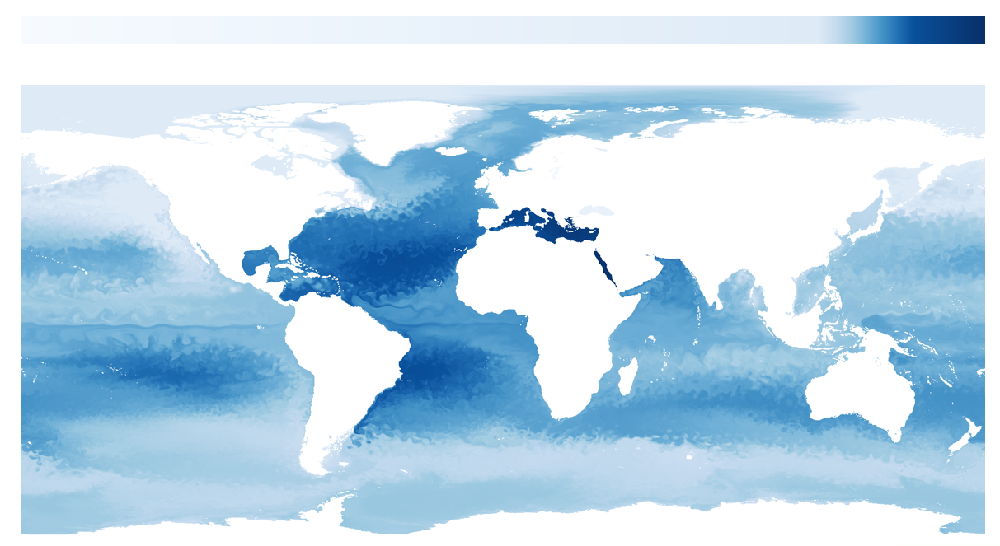
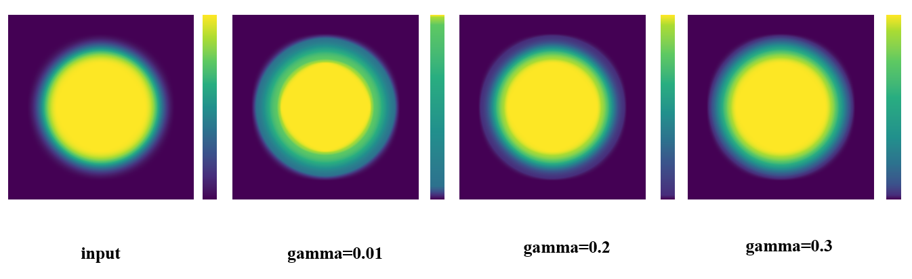

#Data-Driven Colormap Adjustment for Exploring Spatial Variations in Scalar Fields
***
**Introduction: This project is mainly based on a two-dimensional scalar field data visualization method based on color table optimization. The main idea is to adjust the color distribution based on the boundary model, so that the hidden boundary information in the data can be highlighted, so as to observe more data features.**

***

- **Environment configuration: 
 CUDA 9.1 [CUDA download link](https://developer.nvidia.com/zh-cn/accelerated-computing-toolkit "CUDA下载") 
opencv3.4.2 with GPU [opencv download link](http://wiki.opencv.org.cn/index.php/Download "opencv下载") 
Knitro [knitro Official website link](https://www.artelys.com/solvers/knitro/ "knitro官网") 
python3 [python download link](https://www.python.org/downloads/ "python下载") 
Notice: 
1.The installed version needs to be the same as the version number specified above, otherwise it will be very troublesome to configure the environment later. 
2.The computer needs to have an independent display. The algorithm is based on GPU acceleration, and GPU acceleration can effectively improve the running time of the algorithm. 
3.Knitro is a commercial algorithm optimization solver. Individuals can apply for one-month full version use rights through academic mailboxes. After the free trial period ends,  you need to buy it yourself. 
**

***
- **File Description: 
cMap ------The class of colormap, which is a piecewise linear function 
cMapOpt -------There is a class that calculates the objective function 
cMapUtils ------It contains various tool functions, mainly auxiliary calculation 
myColor ------It contains the calculation of CIEDE2000 and CIE76 distances in the color space 
stdafx  ------It contains various macros and constants, as well as file and color table names 
interface ------It provides a function interface for color table optimization 
main ------It is mainly used as the entrance of the algorithm, and the input and parameters are all in this file.
**
***
- **Input and output: 
Input: two-dimensional scalar field data and colormap, corresponding to the data in the input file and the  colormap file respectively 
 
Output:the result of mapping the 2D scalar field data with the optimized colormap
 
**

***
- **parameter settings: 
&emsp;&emsp;The algorithm mainly includes two parameters: the fidelity parameter gamma and the boundary influence parameter eta. 
&emsp;&emsp;The gamma parameter mainly controls the similarity of the newly generated colormap to the original colormap.
A smaller gamma parameter will show more characteristics of the data, and will also cause a greater difference between the originalmap and the new colormap; a larger gamma parameter will reduce the original colormap and the new colormap differences between the colormaps. The schematic diagram is as follows: 

&emsp;&emsp;The eta parameter mainly affects the boundary characteristics of the data, and a smaller eta parameter will highlight the boundary characteristics of the data;
A larger eta parameter will weaken the boundary characteristics of the data. The schematic diagram is as follows: 

**

***
- **Links to related papers: 
[Paper reference](https://ieeexplore.ieee.org/document/9527154 "Data-Driven Colormap Adjustment for Exploring Spatial Variations in Scalar Fields")
**

