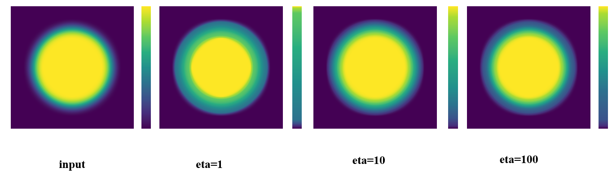

#Data-Driven Colormap Adjustment for Exploring Spatial Variations in Scalar Fields
***
**简介：该项目主要是基于颜色表优化的二维标量场数据可视化方法，其主要思想是：基于边界模型调整色彩分布，使得数据中隐藏的边界信息得以凸显，从而观察到更多的数据特征。**

***

- **所需环境配置： 
 CUDA 9.1 [CUDA下载链接](https://developer.nvidia.com/zh-cn/accelerated-computing-toolkit "CUDA下载") 
opencv3.4.2 with GPU [opencv下载链接](http://wiki.opencv.org.cn/index.php/Download "opencv下载") 
Knitro [knitro官网链接](https://www.artelys.com/solvers/knitro/ "knitro官网") 
python3 [python下载链接](https://www.python.org/downloads/ "python下载") 
注意点： 
1.装的版本都需要跟以上指定的版本号相同，不然之后环境配置起来就很麻烦； 
2.电脑需要有独显，该算法是基于GPU加速的算法，通过GPU加速可有效提升算法的运行时间; 
3.Knitro是一款商业的算法优化求解器，个人可以通过学术邮箱可以申请一个月的完整版使用权，免费试用期结束后，如还需使用则需要自己购买; 
**

***
- **代码文件简述： 
cMap ------里面编写的是colormap的类，是一个分段线性函数 
cMapOpt -------里面有计算目标函数的类 
cMapUtils ------里面各种工具函数，主要是辅助计算 
myColor ------里面是计算颜色空间中的CIEDE2000和CIE76距离 
stdafx  ------里面包含各种宏和常量，还有文件和颜色表名 
interface ------里面提供了颜色表优化的函数接口 
main ------主要作为算法的入口，输入以及调参都在该文件里
**
***
- **输入和输出： 
输入：二维标量场数据和颜色表，分别对应input文件中的data和colormap里面的txt文件 
 
输出：png图片（二维标量场数据用优化后的colormap映射的结果）
 
**

***
- **参数设置： 
&emsp;&emsp;该算法主要包含两个参数：分别是保真度参数gamma和边界影响参数eta; 
&emsp;&emsp;gamma参数主要控制新生成的色彩表与原始色彩表的相似度。
一个更小的gamma参数将会展示更多的数据特征，同时也会造成原始色彩表和新的色彩表之间的更大的差异性；一个更大的gamma参数将会减少原始色彩表和新的色彩表之间的差异性。示意图如下： 

&emsp;&emsp;eta参数主要影响数据的边界特征，一个更小的eta参数将会凸显数据的边界特征；
一个更大的eta参数，将会削弱数据的边界特征。示意图如下： 

**

***
- **相关论文链接： 
[论文参考链接](https://ieeexplore.ieee.org/document/9527154 "Data-Driven Colormap Adjustment for Exploring Spatial Variations in Scalar Fields")
**

